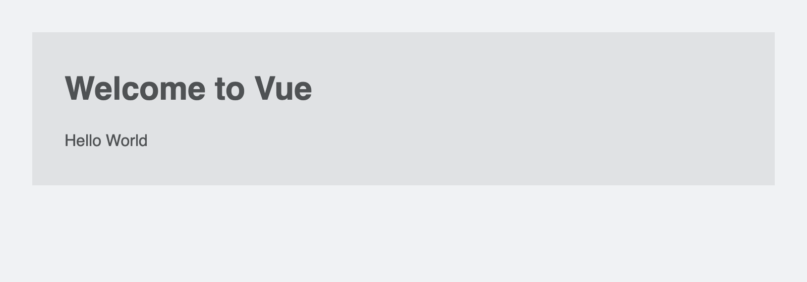

# Hello 3

Simple 'Hello World' component with Vue 2.

> Note: The latest Vue 2 version used here is 2.6.14.

---

## Run this project

1. **Install dependencies**

```
yarn
````


2. **Preview in the browser**

```
yarn start
```

> Note: The above command will open `index.html` on port 20222.
